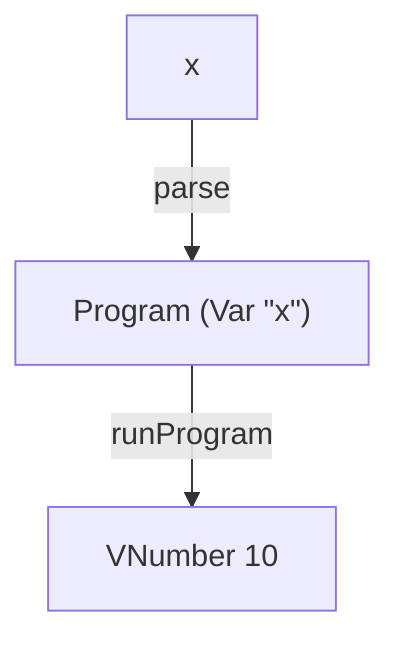

# VAR

A tiny interpreter in Elm that adds variable expressions and environments, showing how variable lookup makes evaluation depend on context.

VAR builds on [IF](https://blog.tinyinterpreters.dev/posts/if) by allowing programs to refer to predefined values by name.

Read [VAR: Adding Variables and Environments to a Tiny Interpreter in Elm](https://blog.tinyinterpreters.dev/posts/var) for a guided explanation of how it works.



## Usage

You’ll need [Nix](https://nixos.org/) with flakes enabled.

Enter the development environment and start the Elm REPL:

```bash
nix develop
elm repl
```

Import the interpreter and run a program:

```elm
import VAR.Interpreter as I

I.run "x"
-- Ok (VNumber 10)
```

## Language

VAR supports the constants, difference expressions, `zero?` expressions, and conditional expressions introduced by the previous interpreters.

It also adds variable expressions. An identifier contains one or more lowercase letters:

```txt
x
value
onetwothree
```

The words `if`, `then`, and `else` are reserved and cannot be used as variable names.

Variables can also appear inside larger expressions:

```elm
I.run "if zero?(-(5, v)) then i else v"
-- Ok (VNumber 1)
```

Only names present in the initial environment evaluate successfully. A valid identifier that is not present in the environment produces an identifier-not-found runtime error.

## Variables and environments

The AST for a variable expression stores the name being referenced:

```elm
Var "x"
```

It does not store the value associated with that name. The evaluator finds the value by looking up the name in an environment.

VAR evaluates programs using this initial environment:

```txt
x ↦ VNumber 10
v ↦ VNumber 5
i ↦ VNumber 1
```

Evaluating `Var "x"` looks up `x` and returns `VNumber 10`.

Only variable expressions inspect the environment directly, but the evaluator passes the environment through every recursive call so that variables can appear anywhere an expression is expected.

VAR does not change the environment during evaluation. Programs can refer to predefined names, but they cannot introduce new names themselves.

## Tiny Interpreters

VAR is part of [Tiny Interpreters](https://blog.tinyinterpreters.dev), a blog about learning how programming languages work by building small interpreters in Elm.
