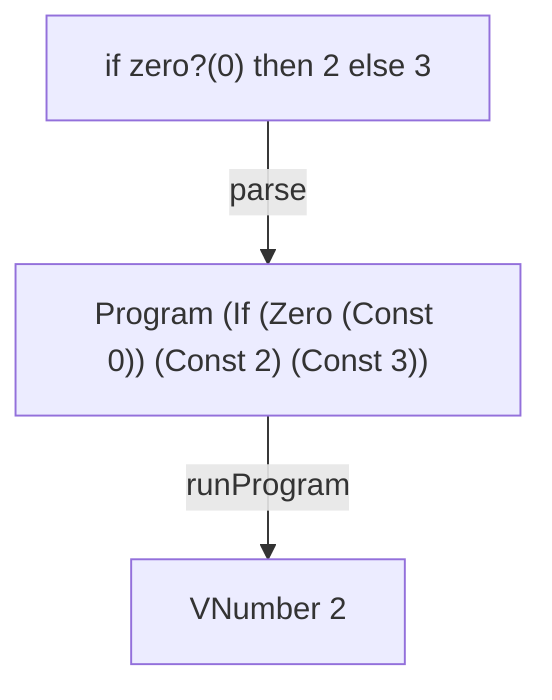

# IF

A tiny interpreter in Elm that adds conditional expressions and introduces selective evaluation.

IF builds on [ZERO](https://github.com/tinyinterpreters/zero) by turning Boolean values from results into decisions.

Read [IF: Adding Conditional Expressions to a Tiny Interpreter in Elm](https://blog.tinyinterpreters.dev/posts/if) for a guided explanation of how it works.



## Usage

You’ll need [Nix](https://nixos.org/) with flakes enabled.

Enter the development environment and start the Elm REPL:

```bash
nix develop
elm repl
```

Import the interpreter and run a program:

```elm
import IF.Interpreter as I

I.run "if zero?(0) then 2 else 3"
-- Ok (VNumber 2)
```

## Language

IF supports non-negative integer constants:

```txt
123
```

Difference expressions:

```txt
-(5, 3)
```

The `zero?` predicate:

```txt
zero?(0)
```

And conditional expressions:

```txt
if zero?(0) then 2 else 3
```

A conditional expression evaluates its condition first. The condition must produce a Boolean value; otherwise, evaluation fails with a runtime type error.

If the condition evaluates to `true`, the then branch is evaluated. If it evaluates to `false`, the else branch is evaluated.

The two branches do not need to produce the same kind of value.

## Conditional expressions

The main change in IF is that the interpreter cannot evaluate every subexpression before deciding what to do.

The condition is evaluated first, but the two branches remain as expressions:

```elm
evalIf : Value -> Expr -> Expr -> Result RuntimeError Value
```

The resulting Boolean value selects which branch is passed to the evaluator. Only the selected branch is evaluated; the other branch remains unevaluated.

For example:

```txt
if zero?(0) then 2 else -(zero?(0), 1)
```

The else branch would produce a runtime type error if evaluated. Because the condition evaluates to `true`, only the then branch is evaluated and the complete expression produces `VNumber 2`.

## Tiny Interpreters

IF is part of [Tiny Interpreters](https://blog.tinyinterpreters.dev), a blog about learning how programming languages work by building small interpreters in Elm.
